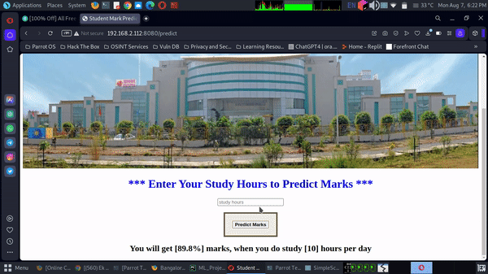

# Student Marks Predictor Web Application

  

Welcome to the Student Marks Predictor web application repository! This application lets you predict student marks using a machine learning algorithm, all wrapped up in a sleek Flask-powered frontend. Whether you're a frontend enthusiast or a machine learning aficionado, this project showcases the power of collaboration between both worlds.

## Features

- **User-Friendly Interface:** The frontend, built with HTML and CSS, offers a smooth and intuitive experience for users.
- **Seamless Backend Integration:** The Flask backend smoothly handles user requests and interacts with the machine learning model.
- **Predictive Analytics:** Leverage the power of a pre-trained machine learning model to predict student marks with high accuracy.
- **Easy to Deploy:** Simply clone the repository and follow the instructions to get the app up and running.

## Getting Started

1. Clone this repository to your local machine.
2. Install the required dependencies using `pip install -r requirements.txt`.
3. Run the app with `python app.py`.
4. Access the app through your web browser.

## Preview

  

## Contributing

Contributions are always welcome! If you find any bugs or have suggestions for improvements, feel free to submit an issue or pull request.

## License

This project is licensed under the MIT(LICENSE).

---

**Disclaimer:** This project is for educational purposes only. The machine learning model predictions are based on sample data and should not be used for actual decision-making.

Created with ❤️ Keshav Kumar Jha.

Connect with me on LinkedIn: www.linkedin.com/in/keshav-kumar-jha-149787247
🚀 Happy predicting!
